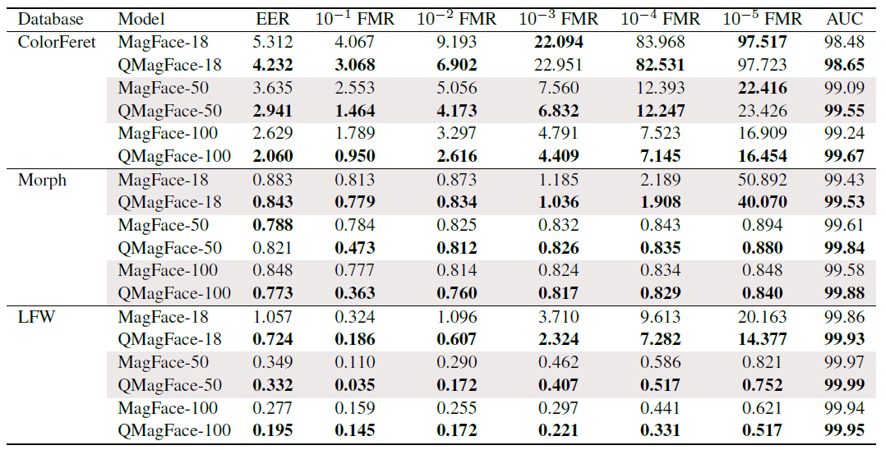
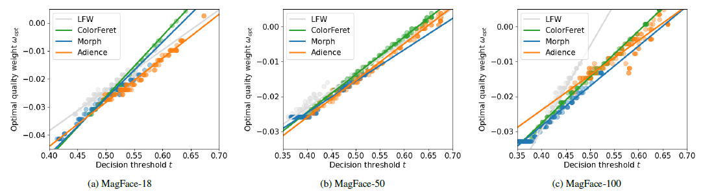

# Quality-Aware Face Recognition


## QMagFace: Simple and Accurate Quality-Aware Face Recognition

* [Research Paper](https://arxiv.org/abs/2111.13475)


## Table of Contents 

- [Abstract](#abstract)
- [Results](#results)
- [Installation](#installation)
- [Citing](#citing)
- [Acknowledgement](#acknowledgement)
- [License](#license)

## Abstract


Face recognition systems have to deal with large variabilities (such as different poses, illuminations, and expressions) that might lead to incorrect matching decisions. These variabilities can be measured in terms of face image quality which is defined over the utility of a sample for recognition. Previous works on face recognition either do not employ this valuable information or make use of noninherently fit quality estimates. In this work, we propose a simple and effective face recognition solution (QMag- Face) that combines a quality-aware comparison score with a recognition model based on a magnitude-aware angular margin loss. The proposed approach includes modelspecific face image qualities in the comparison process to enhance the recognition performance under unconstrained circumstances. Exploiting the linearity between the qualities and their comparison scores induced by the utilized loss, our quality-aware comparison function is simple and highly generalizable. The experiments conducted on several face recognition databases and benchmarks demonstrate that the introduced quality-awareness leads to consistent improvements in the recognition performance. Moreover, the proposed QMagFace approach performs especially well under challenging circumstances, such as crosspose, cross-age, or cross-quality. Consequently, it leads to state-of-the-art performances on several face recognition benchmarks, such as 98.50% on AgeDB, 83.95% on XQLFQ, and 98.74% on CFP-FP.


## Results

The proposed approach is analysed in three steps. 
First, we report the performance of QMagFace on six face recognition benchmarks against ten recent state-of-the-art methods in image- and video-based recognition tasks to provide a comprehensive comparison with state-of-the-art. 
Second, we investigate the face recognition performance of QMagFace over a wide FMR range to show its suitability for a wide variety of applications and to demonstrate that the quality-aware comparison score constantly enhances the recognition performance. 
Third, we analyse the optimal quality weight over a wide threshold range to demonstrate the robustness of the training process and the generalizability of the proposed approach.

In the following, we will only show some results. For more details and dicussions, please take a look at the paper.

 

**Performance on face recognition benchmarks** - The face recognition performance on the four benchmarks is reported in terms of benchmark accuracy (%). The
highest performance is marked bold. The proposed approach, QMagFace-100, achieves state-of-the-art face recognition performance, especially in cross-age (AgeDB), cross-pose (CFP-FP), and cross-quality (XQLFW) scenarios.
Since the FIQ captures these challenging conditions and the quality values represent the utility of the images for our specific network, the proposed quality-aware comparison score can specifically address the circumstance and their effect on the network. 
Consequently, it performs highly accurate in the cross-age, cross-pose, and cross-quality scenarios and achieves state-of-the-art performances.


**Face recognition performance over a wide range of FMRs** - The face recognition performance is reported in terms of FNMR [%] over a wide range of FMRs. The MagFace and the proposed QMagFace approach are compared for three backbone architectures on three databases. The better values between both approaches are highlighted in
bold. In general, the proposed quality-aware solutions constantly improve the performance, often by a large margin. This is especially true for QMagFace based on the iResNet-100 backbone.

 

**Robustness analysis** - The optimal quality weight for different decision thresholds is reported on four databases. 
Training on different databases lead to similar linear solutions for the quality-weighting function. The results demonstrate that (a) the choice of a linear function
is justified and (b) that the learned models have a high generalizability since the quality-weighting function trained on one database is very
similar to the optimal functions of the others.

 


## Installation
The environment was tested with an RTX3080 on Windows 11.

1. Download our precomputed MagFace embeddings and pairs files from [here](https://drive.google.com/file/d/1ElwkUKFs6-4JEwRnsKh6fJLp00x_FOvS/view?usp=sharing) and extract them in the QMagFace root directory. 
2. Download the MagFace100 model from [here](https://drive.google.com/file/d/1Bd87admxOZvbIOAyTkGEntsEz3fyMt7H/view) and place it in the ``_models/magface_models/`` directory. 
The file directory should look something like this:
```
QMagFace
    _data
        ijb
        pairs
        single_images
    _models
        magface_models
            magface_epoch_00025.pth
        mtcnn-model
    datasets
    ...
```
3. Create an environment with `conda env create -f environment.yml`. If you do not need/want to compute your own aligned images you can remove mxnet.
If you do not need to compute embeddings, you can remove pytorch, torchvision and cudatoolkit.
4. After Creating the environment you might need to run ``conda install pandas`` before running the experiments.
5. If you have your own pairs file, or a database with a special filename format, you can implement your own functions
for handling these cases.

## Align  Images
Before we can compute embeddings we have to align the images. We tried our best to recreate the same alignment process that was used for MagFace,
however in order to recreate the results we had to get the already aligned images from ArcFace. To align the images run
```
python align_images.py -s path/to/source/images -r path/where/to/save/aligned/images
```

## Compute Embeddings
Once we have a directory with aligned images we can use these images to compute our embeddings. To do so, run
```
python embed_images.py -s path/to/aligned/images -r directory/where/to/save/embeddings -d dataset_name -m _models/magface_models/magface_epoch_00025.pth
```

## Experiments
To evaluate the lfw-like benchmarks run launch_experiments.py with --experiments name. For example, to run the single
image benchmarks, with training on adience, run
```
python launch_experiments.py --experiment single_image --train_db adience -t agedb -t calfw -t cfp -t lfw -t xqlfw
```
Or recompute our results by using the precomputed alpha and beta values 
```
python launch_experiments.py --experiment single_image --alpha 0.077428 --beta 0.125926 -t agedb -t calfw -t cfp -t lfw -t xqlfw
```

To run the robustness analysis from our paper run
```
python launch_experiments.py --experiments robustness 
```

To convince yourself that our method runs quickly, run the runtime analysis with
```
python launch_experiments.py --experiment runtime --train_db adience
```

For memory consumption check out
```
python launch_experiments.py --experiment memory --train_db adience
```


## Citing

If you use this code, please cite the following paper.

```
@article{QMagFace,
  author    = {Philipp Terh{\"{o}}rst and
               Malte Ihlefeld and
               Marco Huber and
               Naser Damer and
               Florian Kirchbuchner and
               Kiran Raja and
               Arjan Kuijper},
  title     = {{QMagFace}: Simple and Accurate Quality-Aware Face Recognition},
  journal   = {CoRR},
  volume    = {abs/2111.13475},
  year      = {2021},
  url       = {https://arxiv.org/abs/2111.13475},
  eprinttype = {arXiv},
  eprint    = {2111.13475},
}
```

If you make use of our implementation based on MagFace, please additionally cite the original .

## Acknowledgement

This research work has been funded by the German Federal Ministry of Education and Research and the Hessen State Ministry for Higher Education, Research and the Arts within their joint support of the National Research Center for Applied Cybersecurity ATHENE.
Portions of the research in this paper use the FERET database of facial images collected under the FERET program, sponsored by the DOD Counterdrug Technology Development Program Office.
This work was carried out during the tenure of an ERCIM ’Alain Bensoussan‘ Fellowship Programme.

## License 

This project is licensed under the terms of the Attribution-NonCommercial 4.0 International (CC BY-NC 4.0) license.
Copyright (c) 2021 Fraunhofer Institute for Computer Graphics Research IGD Darmstadt

